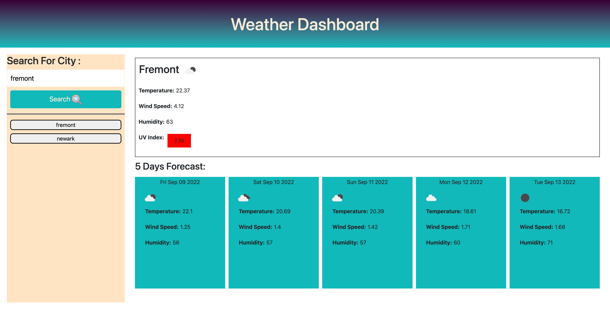

<h1>Assignment03-Whats-The-Weather</h1>

This assignment is about fetching current and, 5 days weather data from across the world from an API

<h3>On the screen you will see</h3>
<ol>
<li>When you enter a city name in "Enter the city name" search box, then you will see current and 5 days weather data</li>
<li>In the top right panel, you will see temparature, Wind speed, humidity and UV Index of current day</li>
<li>The UV Index will display Green if its low, moderate if its Yellow, Orange if its High, Red if its Very High and Purple if its Extremly High</li>
<li>Also the icon of weather is displays</li>
<li>The bottom right panel displays 5 days weather</li>
<li>The search city is saved</li>
<li>When you click on the saved city, you will be able to see the weather of that city again</li>

</ol>

<h3>Link of Github</h3>

https://github.com/rimadas9878/Assignment06-Whats-The-Weather

<h3>Link of Website</h3>

https://rimadas9878.github.io/Assignment06-Whats-The-Weather/

<h3>Image of the prompt messages</h3>

